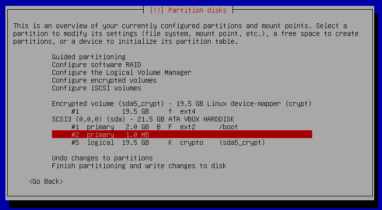
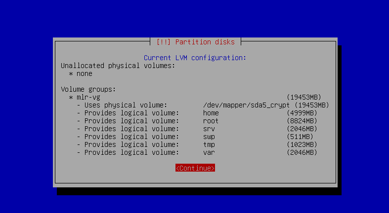
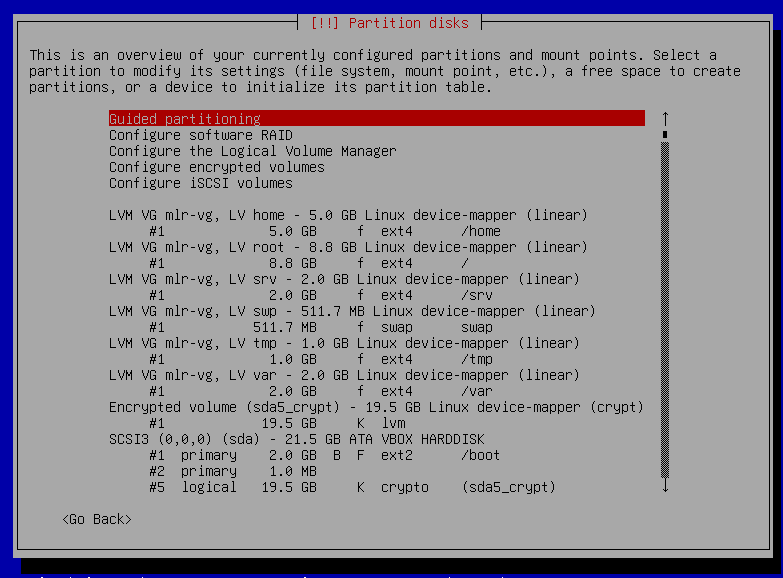
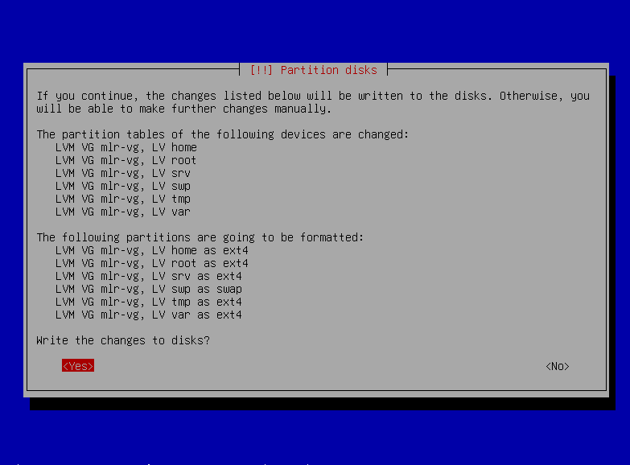
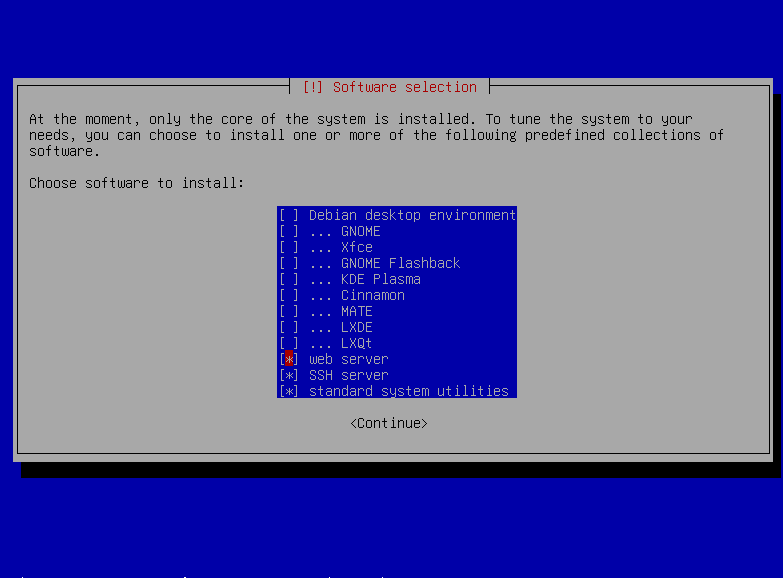

# Installation

Make sure all your passwords respect the password policy defined in the subject.
 
Try to at least use 20 GB for your VM.

## Locale Setup
Free choice, irrelevant. Spam enter to speed through the process and get the default en_US locale/keymap.

## Default Account Setup
Name things according to the subject - hostname should be your intra username followed by '42', account username should be your intra username.
 
e.g:
- Hostname: maloryware42
- Username: maloryware

## Disk Setup

1. Select 'Manual Partitioning'
2. Hover your disk and press enter
3. Create three partitions: two primary (one 2 GB ext2 mounted on /boot, another 1 KB unused) and one logical (with the rest of your available space, mounted as "physical volume for encryption")
4. Select `Configure encrypted volumes` and select your `sda5` volume
5. Input your encryption password.
6. Wait.

7. Select `Configure the Logical Volume Manager`
8. Create a volume group (name it something like mygroup-vg)
9. Assign it to your logical volume (`sda5_crypt`)
10. Create however many logical volumes you want, depending on the bonus, and give them the proper mount points:
-	`/root`&emsp; -->&emsp; /
-	`/home`&emsp; -->&emsp; /home
-	`/var` &emsp;&nbsp; -->&emsp; /var
-	`/tmp` &emsp;&nbsp; -->&emsp; /tmp
-	`/srv` &emsp;&nbsp; -->&emsp; /srv
-	`/swp` &emsp;&nbsp; -->&emsp; [SWAP]

11. All set. Write your changes.

12. I lied. You need to also uncheck `Debian desktop environment` (& everything under it with a `...`), otherwise you gotta redo the entire process. 

Now you're done. Just say 'yes' to anything it asks you. 
 
You can now boot into the machine, and move on to the next step.