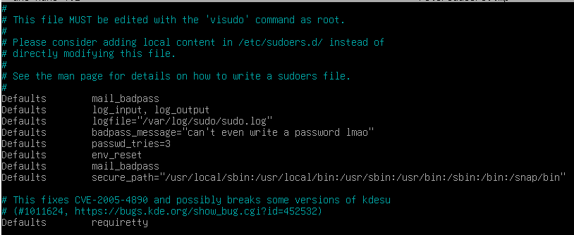

# Sudo Setup

NOTE: AppArmor comes with Debian, and automatically starts on boot. It's a self-solving problem. Google it so you know what it is and how it works, but you don't need to do anything about it.
### Installing Sudo

1. Switch to root (`su -`)
2. Update your `apt` packages (`apt update && apt upgrade`)
3. Install Sudo (`apt install sudo`)

### Configuring Sudo

1. Create the sudo log directory (`mkdir -p /var/log/sudo`)
2. Open `/etc/sudoers/` <s>in nano (or vim if you're a loser)</s> using `sudo visudo`
3. Add the following block to your sudoers file:
```
Defaults	log_input, log_output
Defaults	logfile="/var/log/sudo/sudo.log"
Defaults	badpass_message="Write a *real* password, will you?"
Defaults	passwd_tries=3
Defaults	env_reset
Defaults	mail_badpass
Defaults	secure_path="/usr/local/sbin:/usr/local/bin:/usr/sbin:/usr/bin:/sbin:/bin:/snap/bin"
Defaults	requiretty
```


I know. Very difficult. Herculean task insofar.

While you're at it, create the groups `user42` and `sudo` (`addgroup -f user42; addgroup -f sudo`) and add your user account to those same groups (`usermod -aG user42,sudo [username]`). Verify that they were properly applied using `groups [username]`.

Boom. Rocket science happens.