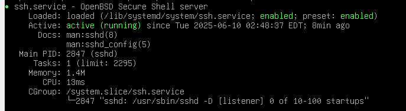

# Network Setup

Time for another arduous and extenuating task.

## Setup SSH

1. If you selected SSH during the installation process, then you're already halfway there. Otherwise, install OpenSSH (`sudo apt install -y openssh-server`).
2. Add your rules to the SSH configuration file (`/etc/ssh/sshd_config`)
	- Rules to add:
		- `Port 4242`
		- `PermitRootLogin no`
3. Restart the SSH service to apply changes (`sudo service ssh restart` or `sudo systemctl restart ssh`)

4. **(Optional)** Confirm the status of the SSH service (`sudo service ssh status` or `sudo systemctl status ssh`)

## Configure UFW

1. Install UFW (you should know the command by now.)
2. Enable UFW since `systemctl` doesn't like doing anything it's not specifically told to (`sudo systemctl enable --now ufw; sudo ufw enable`)
3. Add the rule (`sudo ufw allow 4242`)
4. Restart UFW (I'll let you guess this one. Hint: `systemctl`.)
5. **(Optional)** Confirm the status of UFW (`sudo ufw status numbered`)
 

